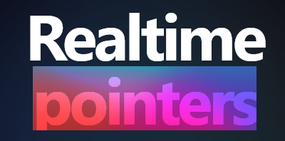

<div align="center">

</div>

# 🎯 Pointers

A real-time collaborative cursor tracking application where you can see other users' mouse movements live on your screen. Built with SvelteKit and Supabase for seamless real-time synchronization.

## ✨ Features

- **Real-time cursor tracking** - See other users' mouse cursors moving in real-time
- **Anonymous authentication** - No signup required, just solve a captcha and start
- **Smooth animations** - Buttery smooth cursor movements with tweened transitions
- **Latency monitoring** - Real-time latency indicator to monitor connection quality
- **Random colors** - Each user gets a unique random color for their cursor
- **User avatars** - Generated avatars based on user IDs
- **Responsive design** - Beautiful dark theme with aurora text effects
- **Captcha protection** - Cloudflare Turnstile integration for bot protection

## 🚀 Tech Stack

- **Frontend**: SvelteKit 2.x with Svelte 5
- **Styling**: TailwindCSS with custom animations
- **Real-time**: Supabase Realtime for cursor broadcasting
- **Authentication**: Supabase anonymous auth
- **UI Components**: Custom components with Lucide icons
- **Captcha**: Cloudflare Turnstile
- **Notifications**: Svelte Sonner for toast messages

## 🛠️ Development

### Prerequisites

- Node.js 18+ 
- A Supabase project with Realtime enabled
- Cloudflare Turnstile site key

### Environment Variables

Create a `.env` file with:

```bash
PUBLIC_SUPABASE_URL=your_supabase_url
PUBLIC_SUPABASE_ANON_KEY=your_supabase_anon_key
PUBLIC_TURNSTILE_KEY=your_turnstile_site_key
```

### Installation

```bash
# Install dependencies
npm install

# Start development server
npm run dev

# Open in browser
npm run dev -- --open
```

## 📦 Building

To create a production version:

```bash
npm run build
```

Preview the production build:

```bash
npm run preview
```

## 🎮 How it Works

1. **Authentication**: Users authenticate anonymously through Supabase after solving a Turnstile captcha
2. **Cursor Tracking**: Mouse movements are tracked and throttled to 50ms intervals
3. **Broadcasting**: Cursor positions are broadcast via Supabase Realtime channels
4. **Rendering**: Other users' cursors are rendered with smooth tweened animations
5. **Presence**: Users automatically join/leave the session based on their connection status

## 🔧 Key Components

- **`login.svelte`** - Landing page with captcha and anonymous authentication
- **`pointers.svelte`** - Main application with cursor tracking and real-time sync
- **`AuroraText.svelte`** - Beautiful animated text component with aurora effects
- **`supabaseClient.ts`** - Supabase client configuration

## 📱 Live Demo

Visit [https://pointers.technotalks.net](https://pointers.technotalks.net) to try it out!

## 📄 License

This project is open source and available under the MIT License.
